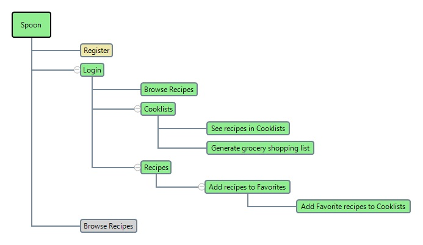

## Spoon

#### Description

Imagine that you are honored (or burdened) with the privilege to prepare Thanksgiving dinner for all your extended family. You may have a rough idea of what the main dish is going to be, maybe think of a couple of appetizers and desserts. But the list keeps growing to the point on which just thinking of going to the supermarket to get all the ingredients may seem like a huge undertaking.  That's when this application may help.

**Spoon** lets you create *cooklists*. Think of them as 'playlists', but instead of adding songs to them, you add recipes.

In **Spoon** you can browse through thousands of recipes, pick your favorites and then organize them in cooklists. When ready to go to the supermarket you can just ask Spoon to generate a grocery list for you. You will get all the recipes' ingredients in one list.

#### Website structure

#### Technologies used

1. Python/Flask, 
2. PostgreSQL, 
3. SQLAlchemy, 
4. Heroku, 
5. Jinja, 
6. RESTful APIs, 
7. JavaScript, 
8. HTML, 
9. CSS

#### Recipe Data

Recipe data (i.e. instructions, ingredients, pictures, etc.) made available by Spoonacular API <https://spoonacular.com/food-api>. If you want to clone or download, you can add the following free tier key, 5db04fdc8ba24bea9ad94eb4cdcb3646, to the privacy.py file (limited to less than 150 calls per day). 

